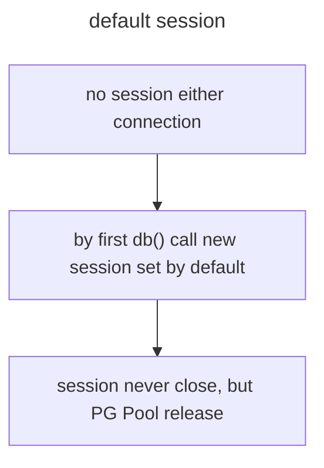
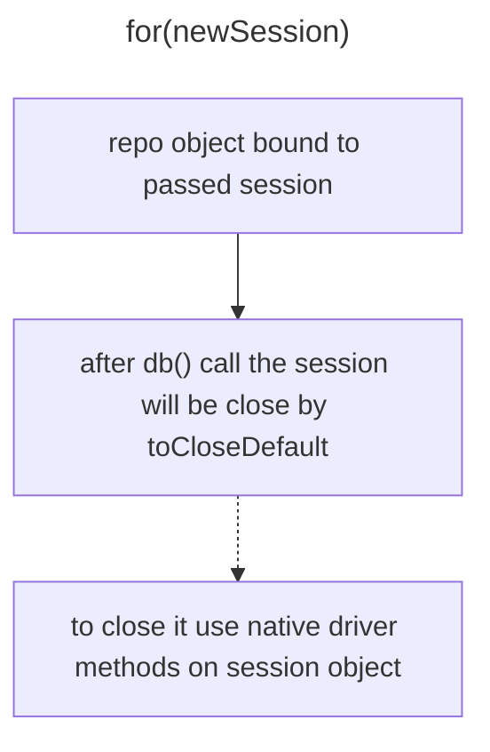
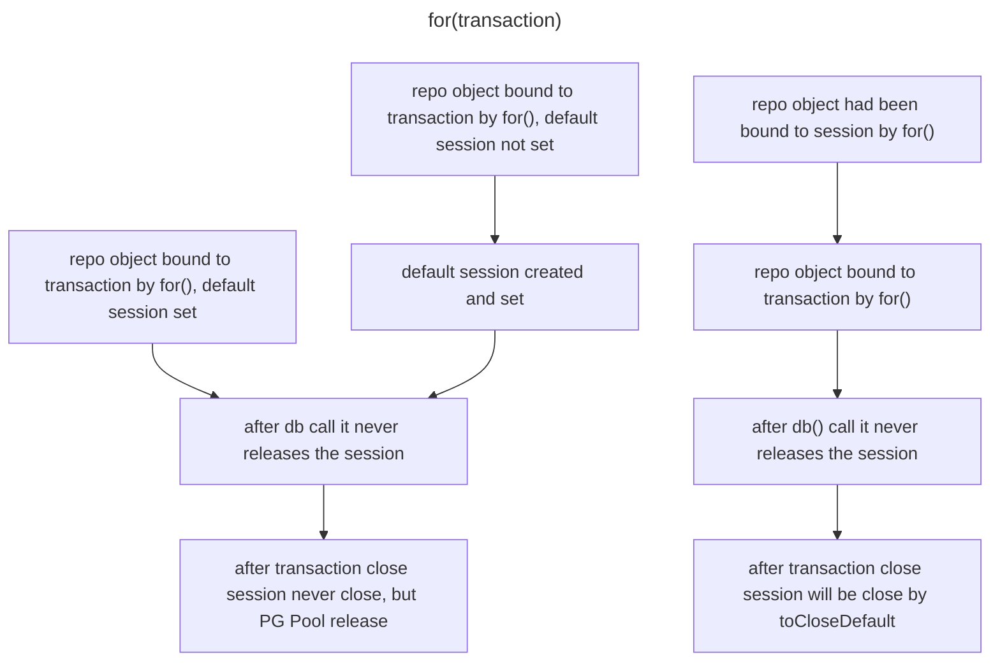

# POSITORY

## Session and Transaction, for()

There are options to create and get new session. Session means sessions for Mongo or Neo4j, means new connection of Client or from Pool for Postgres.

Threre is a way to wrap code in a transaction:

```typescript
const result = await this.userRepo.transaction(async tx => {
  const userRepo = this.userRepo.for(tx);
  const user = await userRepo.getById(userId);
  if(!user) {
    throw new Error('User not found');
  }
  
  const commentList = await this.commentService.fetchForUserId(userId, tx); // pass tx object
  const notCoupledCommentList = await this.bus.call(EVENT.commentService.fetchForUserId, {
    userId,
    transaction: tx,
  });
});
```

Here `tx` is a transaction object. Using `for()` we make transaction bound repo object. 

We also can use `startNewSession()` to get new connection or session, it's not going to be bound to the repo we call it onto. 

However then we may do `.for(newSession)` to get repo bound to the session.

If we never did `for()` the repo object keep using newSession under the hood, never close / release it if configured that way. protected toCloseDefault: boolean 



Highly reccomend to use Pool connection for Postgres. 





